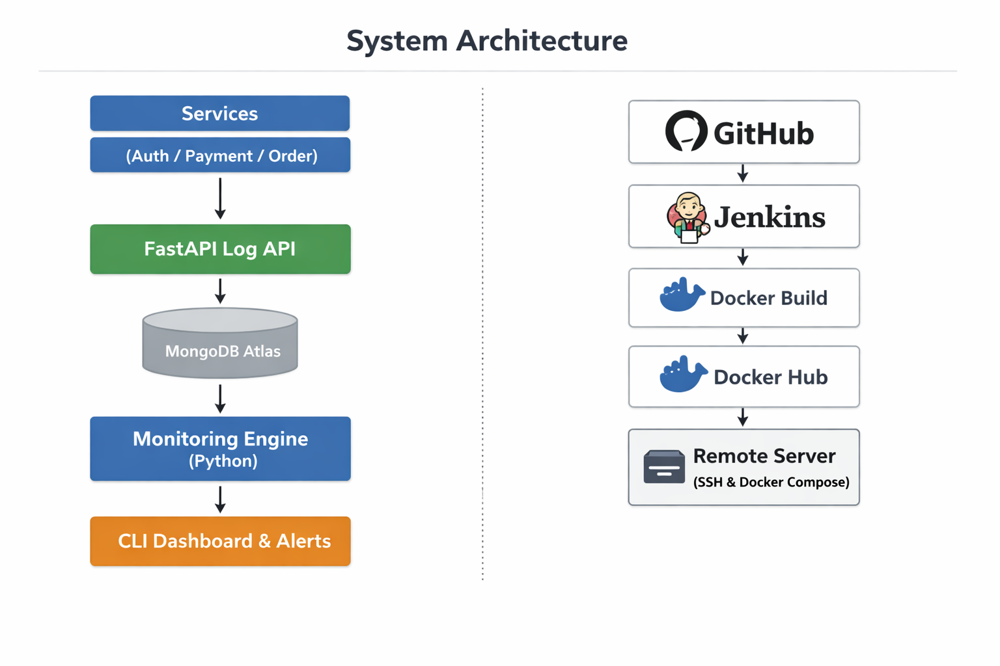

# Smart Log Monitoring, Alert & Retention System
<p align="center">
  
</p>
A DevOps-oriented log monitoring, alerting, and retention system built with FastAPI, MongoDB, and Python, focused on demonstrating how logs are collected, analyzed, and acted upon in backend applications.

The project supports log ingestion via API, interactive CLI-based monitoring, real-time alerts, log summaries, filtering, and automated scheduling using Linux Cron (local) and Python-based schedulers (Docker).

## Table of Contents

- [About](#about)
- [Features](#features-of-the-project)
- [Tech Stack](#tech-stack)
- [Key Highlights](#key-highlights)
- [CI/CD Pipeline](#cicd-pipeline-jenkins)
- [Project Structure](#project-structure)
- [Installation](#installation)
- [Automated Deployment](#automated-deployment)
- [Usage](#usage)
- [Real World Applications](#real-world-applications)

## About 
**What does the project do:**

The Smart Log Monitoring & Alert System is a comprehensive tool for monitoring logs from multiple services. It provides:

- **Real-time log collection:** Collect logs from various services automatically.
- **Log categorization:** Organize logs by severity: INFO, WARNING, ERROR.
- **View all logs / error logs:** Quickly access all logs or only the critical error logs.
- **Filtering:** Filter logs by service or severity for faster troubleshooting.
- **Log summaries:** Generate summaries with total logs, counts by level, and errors by service.
- **Alerts & notifications:** Highlight high-warning, warning, and danger levels based on error thresholds.
- **Persistent logging:** Maintain a record of all logs in a database (MongoDB).
- **Safe and structured storage:** Logs are timestamped and stored with UTC timezone.
- **User-friendly interface:** Console-based interface with clear formatting and colors.
- **APIs available:** RESTful APIs to push and fetch logs programmatically.
- **Error handling & stability:** Handles failed connections, invalid requests, and duplicate logs gracefully.

**Why it exists:**

Manual log checking is tedious and error-prone. Applications can fail silently or generate large volumes of logs, making it hard to find critical issues. This system exists to:

- Automate log monitoring across services.
- Quickly identify errors and warnings, preventing downtime.
- Provide actionable insights through summaries and alerts.
- Support developers and admins in maintaining healthy applications efficiently.

## Features of the project: 
1. Multi-Service Log Monitoring
- Tracks logs from multiple services like Authentication, Payment, and Order services.

2. Log Level Categorization
- Classifies logs into INFO, WARNING, and ERROR.

3. Real-Time Alerts
+ Generates alerts for services with high error counts:

  - 🔴 Danger (≥5 errors)
  - 🟠 Warning (3–4 errors)
  - 🟡 High Warning (1–2 errors)

4. Logs Summary
- Provides a quick summary of logs: total logs, counts of each level, and errors by service.

5. Filter Logs
- Allows filtering logs by service and/or log level.

6. Persistent Storage with MongoDB
- Stores logs in MongoDB for retrieval, analysis, and persistence.

7. User-Friendly Console Interface
- Clear visual output using upper() and lower() for better readability.

8. API Support (Integration ready)
- RESTful endpoints to create, fetch, and delete logs programmatically.

9. Centralized Logging System
- All actions in the monitoring system are logged using Python’s logging module.

10. Time-Based Error Monitoring
- Detects recent error spikes (e.g., within last 1 minute) for faster incident response.

11. Dual Scheduling Mechanism (Local Cron + Docker Python Loop)
- **Local Environment**: Uses native Linux cron jobs to automatically run log monitoring, alert detection, log generation, and cleanup tasks at fixed intervals.

- **Docker Environment**: Uses a Python-based scheduler implemented with an infinite loop and controlled sleep intervals to replicate cron-like behavior inside containers, ensuring better control, portability, and reliability without relying on system cron.

## Tech Stack

**CI/CD Automation**

- Jenkins – CI/CD pipeline automation
- Docker Hub – Container image registry
- SSH Deployment – Automated deployment to remote server

**Programming Language**

- Python 3.12.3

**Backend Framework**

- FastAPI – for building high-performance REST APIs

**Database**

- MongoDB (Atlas) – NoSQL database for persistent log storage

**Database Driver**

- PyMongo – MongoDB client library for Python

**Logging & Monitoring**

- Python Logging Module – for structured application logging

**API & Networking**

- Requests – for making HTTP API calls between services

**Configuration & Environment**

- python-dotenv – for managing environment variables securely

**Scheduling & Automation**

- **Linux Cron** – Efficient OS-level scheduler for local Linux / WSL environments.

- **Python Scheduler (loop + sleep)** – Lightweight, container-friendly mechanism to run periodic tasks inside Docker without relying on system cron, ensuring portability and maintainability.

**Development Environment**

- Linux / WSL

- Virtual Environment (venv)


**Version Control & Collaboration**

- Git

- GitHub

**Containerization & Deployment**

- Docker – Containerization of application services
- Docker Compose – Multi-container orchestration
- Docker Hub – Image registry for storing built images
- Operating System / Infrastructure: Rocky Linux 9 (RHEL-based VM) — Chosen for enterprise-grade stability and production-ready environment.
- Remote Access: SSH (Secure Shell) — For automated, secure communication between Jenkins and the production server.

## Key Highlights

- Real-time log monitoring system
- Automated log retention and cleanup
- Containerized architecture using Docker
- CI/CD pipeline automation using Jenkins
- Production-style deployment using SSH
- MongoDB-based persistent log storage
- Production-Style Deployment: Automated CD (Continuous Deployment) to a remote Rocky Linux VM using Jenkins and SSH, simulating a real-world enterprise infrastructure.

## CI/CD Pipeline (Jenkins)

This project implements a complete CI/CD pipeline using Jenkins, enabling automated build, testing, containerization, and deployment.

### Pipeline Workflow
**1. Source Code Checkout**
- Jenkins pulls the latest code from the GitHub repository.

**2. Docker Image Build**
- Jenkins builds a Docker image of the application.

**3. Automated Testing**
- Containers are started using Docker Compose.
- API tests are executed automatically.

**4. Manual Approval – Docker Push**
- A manual approval step ensures controlled image publishing.

**5. Push to Docker Hub**
- The built image is pushed to Docker Hub registry.

**6. Manual Approval – Deployment**
- Deployment to production requires manual confirmation.

**7. Production Deployment**
- Jenkins connects to a remote server via SSH.
- The latest image is pulled from Docker Hub.
- Existing containers are stopped and replaced with updated containers.
- Jenkins connects to a Remote Rocky Linux Server via SSH.

## Project Structure

**Smart_Log_Monitoring_Alert_System/src**

- **alert_engine.py**      ➡️ cron job 
  -  Cron job to detect ERROR spikes (counts errors in last 1 minute and triggers alerts based on log count and per-service analysis) 

- **alert_runner.py**
  - Python-based scheduler for Docker that periodically executes error spike detection (last 1 minute) using a loop-based timing mechanism.

- **cleanup_logs.py**     ➡️  cron job  
  -  Cron job to automatically delete logs older than 7 days

- **cleanup_runner.py**
  - Python-based scheduler for Docker that periodically runs log retention cleanup to remove logs older than 7 days. 

- **log_producer_app.py**  ➡️  cron job
  - Sample application to generate logs automatically (used for testing and demonstration)

- **producer_runner.py**
  - Python-based scheduler for Docker to periodically generate sample logs for testing.

- **logger_config.py**
  - Central logging configuration (stores application logs in app.log)

- **python_API.py**
  -  FastAPI-based REST API for log ingestion and retrieval

- **monitoring.py**
  - Core monitoring logic for the system

- **utils.py**
  -  Helper and utility functions

- **main.py**
  - Menu-based CLI application (main entry point)

- **requirements.txt**
  - List of required Python packages

**Smart_Log_Monitoring_Alert_System/**

- **.gitignore**
  - Ignore unnecessary files (venv, __pycache__, logs, secrets)

- **Dockerfile**
  - set up for the image 

- **docker-compose.yml**
  - managing multiple containers in the same network 

- **.dockerignore**
  - Exclude files from Docker build context

**Run the CLI application:**

```python main.py```

## Installation 

### 1. clone the repo
- **Github repository:** https://github.com/haneul-24/Smart_Log_Monitoring_Alert_System

- ```git clone https://github.com/haneul-24/Smart_Log_Monitoring_Alert_System.git```

### 2. Create Virtual Environment:

```python -m venv venv```

**Activate it:**

**Linux/WSL**
```source venv/bin/activate```

**Windows**:
```venv\Scripts\activate```

### 3. Install dependencies:
```pip install -r requirements.txt```

### 4. Configure Environment Variables:
Create a ```.env``` file in the project root

### 5. Setup logging:
Logging is automatically configured using ```logger_config.py```.

All logs will be stored in:

```app.log```

### 6. Start the FastAPI Server

```uvicorn python_API:app --reload```

### 7. Test API Endpoints
Open browser or Postman:

```GET  /          → Welcome message```

```POST /logs      → Create logs```

```GET  /logs      → View all logs```

```GET  /logs/error → View ERROR logs```

```DELETE /logs/{id} → Delete a log```

### 8. Setup Cron Job
```crontab -e```

## Cron Job Support

Cron jobs can be configured to:

- Periodically monitor error logs
- Trigger alert checks automatically
- Manage log retention and cleanup

> Note: In Docker environments, cron is replaced with a Python-based scheduler (loop + sleep) to ensure container-friendly execution.

### 9. Run with Docker (Optional / Advanced)

**Build Docker images:**

```docker compose build```

**Start Containers**

```docker compose up```

## Automated Deployment

- Deployment is handled automatically through the Jenkins pipeline to a remote Rocky Linux VM.

**Deployment Process**

- Jenkins securely connects to the Rocky Linux VM using SSH keys.

- The latest Docker image is pulled from Docker Hub onto the Rocky Linux host.

- Existing containers are stopped and removed from the VM.

- Docker Compose redeploys the updated application containers on Rocky Linux VM.

**This ensures:**

- **Zero manual deployment steps:** Fully automated CD (Continuous Deployment) workflow

- **Faster updates on a production-grade VM:** Rapid delivery of code changes to the Rocky Linux VM.

- **Consistent production environments:** Stable setup using Rocky Linux and Docker containers.

- **Reduced human error:** Eliminates risks associated with manual configuration on the VM.

## CI/CD Pipeline Architecture

```
GitHub Repository
        │
        ▼
      Jenkins
        │
        ▼
 Docker Image Build
        │
        ▼
 Automated Tests (Docker Compose)
        │
        ▼
 Manual Approval
        │
        ▼
 Push to Docker Hub
        │
        ▼
 Manual Approval
        │
        ▼
 Remote Server Deployment (SSH)
        │
        ▼
 Docker Compose Production Run
```

## Usage
- Generate logs from multiple services and applications

- Store logs in MongoDB through FastAPI APIs

- View all logs or filter only ERROR-level logs

- Monitor logs using a command-line (CLI) interface

- Filter logs based on service name and log level

- Generate alerts when errors occur frequently

- Automatically clean and retain logs based on time limits

 
## Real World Applications 

- Monitoring microservices and backend systems in production

- Detecting failures in critical services like payment, authentication, and order processing

- Providing timely error alerts for operational monitoring

- Assisting in debugging and root-cause analysis using structured logs

- Validating application behavior during CI/CD deployments

- Maintaining system reliability and reducing downtime through proactive monitoring 

- Demonstrating a real-world CI/CD pipeline with Jenkins, Docker, and automated deployments


## License
This project is licensed under the **MIT License**.

© 2026 Sejal. All rights reserved.


## Author 
**Sejal**

DevOps Project – Built for learning and demonstrating log monitoring and CI/CD workflows.